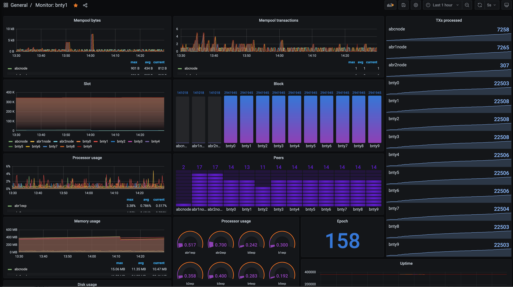

# Node Monitoring

## Grafana Information

Grafana is a several platform open source analytics and interactive visualization application. It can provide charts, graphs, and alerts when connected to supported data sources.

## RTView Information

RTView is an application that allows you to see the state of running Cardano nodes in real-time.

## GLiveview Information

Guild LiveView \(GLiveView\) is a local monitoring tool to be used in addition to remote monitoring tools like Prometheus, Grafana, or IOG's RTView.

## Prometheus

Prometheus is important to monitoring your node because it queries your node and collects data

